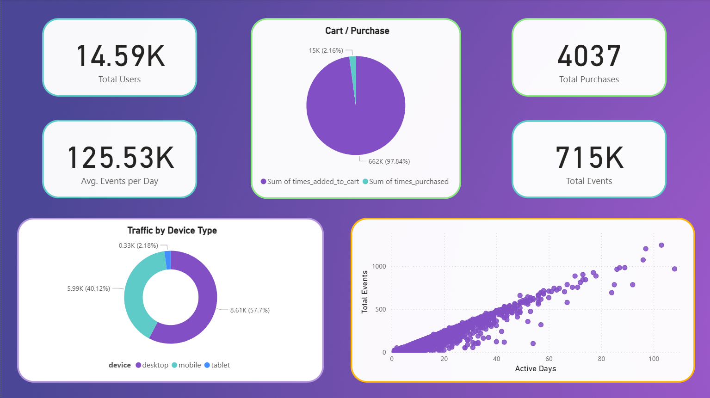

## Web Traffic Analysis (SQL + Python + Power BI)

### Project Overview
This project analyzes a website’s **user traffic, engagement, and conversion behavior** using SQL, Python, and Power BI.  
It focuses on understanding **visitor patterns, device usage, country performance,** and **funnel efficiency** (from *view → cart → purchase*).

The workflow covers **data cleaning, SQL view creation,** and **dashboard design** to uncover actionable insights about digital user behavior.

---

### Tools & Technologies
- **Python (Pandas)** – Data cleaning, optimization, and preprocessing  
- **SQL Server** – Analytical view creation for Power BI reporting  
- **Power BI** – Visualization of traffic, device, and conversion metrics  
- **CSV (Kaggle Dataset)** – Google Merchandise Store analytics events  
- **DAX** – KPI cards and date-based metrics

---

### Repository Structure

```bash
Web-Traffic-Analysis/
│
├── data/
│   ├── events1.csv              # Raw web traffic data (Kaggle)
│   └── clean_events.csv         # Optimized dataset from Python
│
├── python/
│   └── data_optimization.py     # Cleans and optimizes raw dataset
│
├── sql/
│   └── sql_views.sql            # Contains analytical SQL views
│
├── powerbi/
│   └── web_traffic_dashboard.pbix  # Power BI dashboard file
│
└── README.md
```

---

### Mapping Explanation

| Folder / File   | Description                                                         |
|-----------------|---------------------------------------------------------------------|
| `data/`         | Contains raw and cleaned event data used for SQL & Power BI         |
| `python/`       | Python preprocessing scripts (null handling, formatting)            |
| `sql_views.sql` | Defines analytical views (traffic, funnel, engagement)              |
| `powerbi/`      | Dashboard visuals and report file (.pbix)                           |
| `README.md`     | Documentation describing workflow and insights                      |

---

### Example SQL View

```sql
-- vw_FunnelAnalysis
CREATE VIEW vw_FunnelAnalysis AS
SELECT
    COUNT(DISTINCT CASE WHEN type = 'view' THEN user_id END) AS viewed_users,
    COUNT(DISTINCT CASE WHEN type = 'add_to_cart' THEN user_id END) AS cart_users,
    COUNT(DISTINCT CASE WHEN type = 'purchase' THEN user_id END) AS purchased_users
FROM clean_events;
```

This view summarizes the conversion funnel, helping visualize how many users move from browsing to purchase.

---

## Power BI Dashboards

###1) Traffic Overview
- KPI cards for total users, total events, and total purchases  
- Device and country breakdowns  

###2) Funnel & Conversion Analysis
- Funnel chart visualizing *View → Add to Cart → Purchase* stages  
- Identifies user drop-off and conversion rate patterns  

###3) Daily Traffic Trends
- Line chart showing user and purchase activity over time  
- Helps detect campaign, season, or weekday effects  

###4) Product & Engagement Insights
- Product performance matrix (views vs purchases)  
- Histogram showing user engagement (avg events per user)  
- Scatter chart linking engagement with frequency  

---

## Dashboard Sample


---

## Learning Outcomes

Through this project, I developed practical skills in:

- Cleaning and preparing large-scale event data using **Python (Pandas)**  
- Creating analytical and reusable **SQL views** for BI integration  
- Building **interactive Power BI dashboards** with multi-chart layouts  
- Applying **funnel, trend, and engagement analysis** for digital data  

---

## Author

**Harun Bilge**  
Data Analyst | SQL • Python • Power BI  
📍 Istanbul  

🔗 [harunbilge.com](https://harunbilge.com) • [LinkedIn](https://www.linkedin.com/in/harun-bilge-b65a2a292) • [GitHub](https://github.com/Harun-Bilge)
